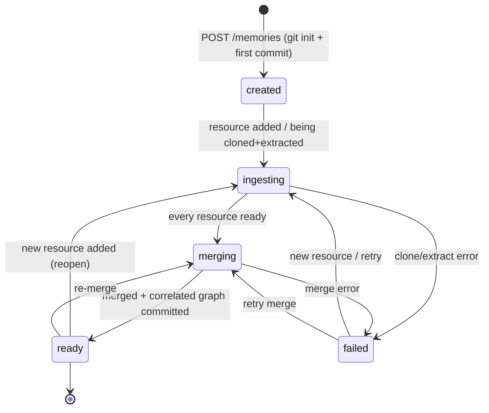
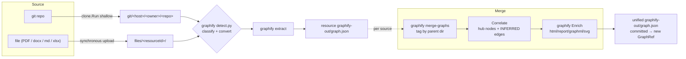
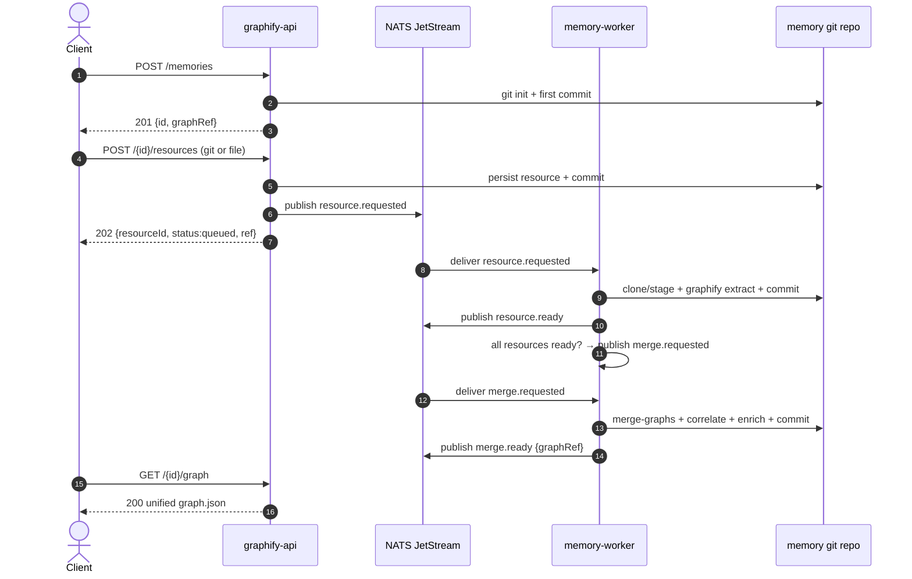
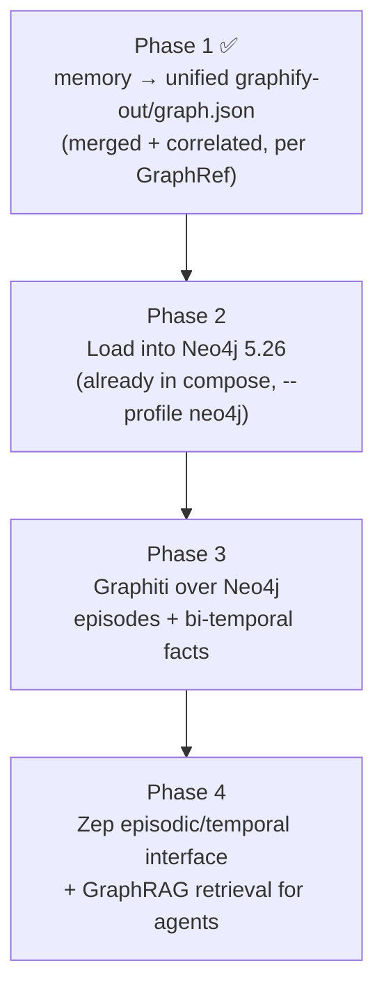

# Memory — Multi-Source Unified Knowledge Graph

**Status:** Phase 1 (backend API + async pipeline) · **Owner:** graphify-service backend · **Last updated:** 2026-07-26

> A **memory** is a user-defined collection of *any number of sources* graphify accepts — one or
> more git repositories **plus** uploaded files (PDF, docx, xlsx, markdown, …) — each extracted
> independently and then **merged into one unified knowledge graph** at a centralized location.
>
> Pairs with the backend spec [`FEATURES-BACKEND-SERVICE.md`](./FEATURES-BACKEND-SERVICE.md) and the
> temporal-graph roadmap in [`GRAPHITI-INTEGRATION.md`](./GRAPHITI-INTEGRATION.md).

---

## 1. TL;DR

- A memory is created **first** (returns an `id` immediately), then **sources** are added one at a
  time, then graph generation is **scheduled automatically** as each source lands, and finally the
  **merged graph** becomes the memory's output.
- Every source is graphified **independently** into its own `graphify-out/graph.json`, and all
  source graphs are **merged** with graphify's native `merge-graphs`, then **correlated** across
  sources (hub nodes + inferred edges).
- A memory directory is **itself a git repository**. Every mutation commits, and the new git HEAD
  SHA is returned as **`graphRef`** — a stable, meaningful pointer to the memory's graph state.
- **Files are NOT RAG.** There is no vector store, no embedding, no chunk-and-retrieve. A file is
  handled exactly like a repo: graphify's `detect.py` classifies/converts it and `graphify extract`
  turns it into graph nodes/edges. See [§6](#6-how-files-are-handled-not-rag).
- **Secrets are never persisted.** No private keys, passphrases, tokens, or authenticated URLs are
  written to `memory.json`. SSH keys are referenced by name and resolved from a mounted secret dir
  at runtime only.

---

## 2. Concepts

| Term | Meaning |
|------|---------|
| **Memory** | The top-level, mutable container. Has an `id`, a name/description, a list of resources, a status, an artifact inventory, and a `graphRef`. |
| **Resource** (a.k.a. *source*) | One input belonging to a memory. `kind` is `git` or `file`. Each is extracted into its own `graphify-out/graph.json`. |
| **GraphRef** | The git HEAD SHA of the memory repo, returned on every mutation. Only `memory.json` + `graphify-out/` are versioned, so the ref pins the graph state. |
| **Unified graph** | The merged + correlated `graphify-out/graph.json` at the memory root — the memory's output. |

Unlike a repository (a one-shot, content-addressed pipeline), a memory is **mutable**: adding a
resource at any time drives it back through ingest → merge, even after it has reached `ready`.

---

## 3. API contract

All routes are under `/api/v1/memories` and are bearer-protected (same auth as the repository API).
IDs are 32-hex (`crypto/rand` 16 bytes); every `{id}`/`{rid}` is guarded by a hex `ValidID` check
before any filesystem lookup (path-traversal defense).

| Method & path | Purpose | Success |
|---------------|---------|---------|
| `POST /api/v1/memories` | Create an empty memory. Body: `{"name","description"}` (both optional). Git-inits + commits immediately so `graphRef` is set from the first response. | `201` + memory view |
| `GET /api/v1/memories` | List memories. Query: `status`, `limit`, `cursor`. | `200` |
| `GET /api/v1/memories/{id}` | Get one memory (manifest + HATEOAS links). | `200` |
| `POST /api/v1/memories/{id}/resources` | Add a source. **JSON body** → git resource; **`multipart/form-data`** (`file` field) → uploaded file. Persists, commits, publishes `resource.requested`. | `202` + `{memoryId,resourceId,kind,status,ref}` |
| `GET /api/v1/memories/{id}/resources` | List resources. | `200` |
| `GET /api/v1/memories/{id}/resources/{rid}` | Get one resource. | `200` |
| `GET /api/v1/memories/{id}/graph` | Stream the merged `graphify-out/graph.json`. | `200` / `409 not_ready` |
| `POST /api/v1/memories/{id}/query` | Ask a question about the merged graph. Composes with `graphify-mcp` (see [§6.2](#62-querying-a-memory-mcp-composition)). Body: `{"question","tool"}`. | `200` / `409 not_ready` |
| `GET /api/v1/memories/{id}/artifacts` | List merged artifacts. | `200` |
| `GET /api/v1/memories/{id}/artifacts/{name}` | Stream one allowlisted artifact. | `200` |
| `GET /api/v1/memories/{id}/download?format=zip` | Zip of merged artifacts (`include`/`exclude` filters). | `200` / `409 not_ready` |

### 3.1 Add a git source (1 or more)

```jsonc
// POST /api/v1/memories/{id}/resources   Content-Type: application/json
{
  "gitRepoUrl": "https://github.com/acme/widget.git",
  "ref": "main",              // optional — branch/tag
  "sha": "",                  // optional — exact commit (mutually exclusive with ref)
  "sshKeyRef": "acme-deploy"  // optional — NAME of a mounted key; the key itself is never stored
}
```

Host allow-listing (`GRAPHIFY_ALLOWED_GIT_HOSTS`) is enforced. `sshKeyRef` must be a simple name
(no path separators); its presence marks the source `private: true`.

### 3.2 Add a file source

```bash
# POST /api/v1/memories/{id}/resources   Content-Type: multipart/form-data
curl -F "file=@handbook.pdf" .../api/v1/memories/$ID/resources
```

The upload is written **synchronously** under `files/<resourceId>/<name>` (original extension
preserved so `detect.py` can classify it); the worker then only extracts. Size is capped by
`GRAPHIFY_MAX_UPLOAD_BYTES`.

### 3.3 Typical flow

```bash
ID=$(curl -sX POST .../api/v1/memories -d '{"name":"acme-platform"}' | jq -r .id)
curl -sX POST .../api/v1/memories/$ID/resources -d '{"gitRepoUrl":"https://github.com/acme/api.git"}'
curl -sX POST .../api/v1/memories/$ID/resources -d '{"gitRepoUrl":"https://github.com/acme/web.git"}'
curl -sX POST .../api/v1/memories/$ID/resources -F "file=@rfc-042.pdf"
# …poll until status == ready…
curl -s .../api/v1/memories/$ID/graph -o unified-graph.json
# …then ask questions across all sources at once:
curl -sX POST .../api/v1/memories/$ID/query -d '{"question":"where is auth handled?"}'
```

### 3.4 Query a memory

```jsonc
// POST /api/v1/memories/{id}/query   Content-Type: application/json
{
  "question": "how does the widget service talk to the API?",  // required for query_graph
  "tool": "query_graph"   // optional — default; also get_node, graph_stats, god_nodes, …
}
```

```jsonc
// 200 response
{ "id": "<memoryId>", "tool": "query_graph", "question": "…", "answer": "…", "isError": false }
```

`409 not_ready` until the merged graph exists. See [§6.2](#62-querying-a-memory-mcp-composition)
for how the answer is produced.

---

## 4. Lifecycle & state machine

A memory status is **permissive about re-entry**: `ready` and `failed` are *not* terminal — a new
resource reopens the pipeline. Per-resource status reuses the repository lifecycle
(`queued → graphifying → ready | failed`).



---

## 5. On-disk layout

A memory lives at `<repos-root>/memories/<id>/`, which is itself a git repo:

```
<root>/<id>/
  .git/                        # working repo; HEAD SHA is the returned GraphRef
  .gitignore                   # ignores git/, files/, .tmp/ (raw working data)
  README.md                    # committed at create
  memory.json                  # the manifest (Memory struct; NO secrets)
  graphify-out/                # ← the merged unified graph (COMMITTED)
    graph.json                 #   networkx node-link JSON, cross-source correlated
    graph.html GRAPH_REPORT.md graph.graphml graph.svg   # best-effort enrich
  git/<host>/<owner>/<repo>/   # raw clone + its own graphify-out/ (GITIGNORED)
  files/<resourceId>/          # raw upload + its own graphify-out/ (GITIGNORED)
  .tmp/                        # staging for clones + merge label dirs (GITIGNORED)
```

Only `memory.json` and `graphify-out/` are versioned. Raw clones/uploads are gitignored (large,
may carry nested `.git`, reproducible), so the `graphRef` is a clean pointer to the graph state.

The merged output deliberately uses the conventional `graphify-out/` name so the existing
`artifacts` package (`Inventory`/`Select`/`Zip`) and `graphify.Enrich` — which all read
`<dir>/graphify-out` — apply to the memory dir with **no copying**.

---

## 6. How files are handled (NOT RAG)

**Question: does a "file" get RAG'd (chunked, embedded, stored in a vector DB, retrieved by
similarity)? → No.**

A file resource is handled by the **exact same extraction path** as a git repo. graphify's
`detect.py` inspects each file, classifies its type, converts it to text/structure, and
`graphify extract` turns it into **graph nodes and edges** — deterministic, LLM-free in the default
`--code-only` mode. There is no embedding model, no vector index, and no retrieval step anywhere in
this pipeline. The output of a file is a `graph.json`, identical in shape to a repo's.

### 6.1 How each file/source type is managed

| Source type | Detected/converted by | What `graphify extract` produces |
|-------------|-----------------------|----------------------------------|
| **Git repo (code)** | language/AST parsers | Structural graph: files, symbols, functions, classes, imports, call/dependency edges |
| **Markdown / text** | `detect.py` (text) | Document structure: sections, headings, links, referenced entities |
| **PDF** | `detect.py` → text conversion | Extracted text turned into document/entity nodes |
| **DOCX / office docs** | `detect.py` → text conversion | Same document-graph treatment as PDF/markdown |
| **XLSX / tabular** | `detect.py` → structured conversion | Rows/columns/entities as nodes |

Because classification/conversion lives entirely inside graphify's `detect.py`, **adding a new file
type needs no change to graphify-service** — the worker calls the same `graphify.Extract` regardless
of `kind`. File resources skip the clone step; git resources skip nothing.



> If a git repo already ships a committed `graphify-out/`, extraction is **skipped** and the
> committed graph is used as-is.

### 6.2 Querying a memory (MCP composition)

`POST /api/v1/memories/{id}/query` answers questions about the merged graph using the **same
`graphify-mcp` server** that serves repository queries — there is **no memory-specific MCP service**.

graphify's MCP server (`graphify.serve`) runs **stateless** with `--json-response`, and every tool
call resolves its graph from a per-call `project_path`: `<project_path>/graphify-out/graph.json`.
The API injects `project_path = <repos-root>/memories/<id>` (the memory dir), so the one shared
server resolves that memory's **merged, cross-source unified graph** — exactly what the memory
worker committed. Because `graphify-mcp` and the memory worker mount the **same `./data/repos`
volume**, no copying or extra plumbing is needed.

This is identical to the repository `/query` composition, only the injected `project_path` differs
(a memory dir instead of a repo dir). Available tools: `query_graph` (default; needs `question`),
`get_node`, `get_neighbors`, `get_community`, `god_nodes`, `graph_stats`, `shortest_path`.

```mermaid
sequenceDiagram
    autonumber
    actor U as Client
    participant API as graphify-api
    participant MCP as graphify-mcp (stateless)
    participant V as ./data/repos (shared volume)

    U->>API: POST /memories/{id}/query {question}
    Note over API: guard ValidID(id); require status == ready
    API->>MCP: tools/call query_graph<br/>project_path = memories/{id}
    MCP->>V: read memories/{id}/graphify-out/graph.json
    MCP-->>API: answer (text content)
    API-->>U: 200 {id, tool, question, answer, isError}
```

> The endpoint returns `409 not_ready` until the memory reaches `ready` (the merged graph must
> exist before a query can resolve it).

---

## 7. Async pipeline (events)

The API only persists + publishes; a dedicated `graphify-memory-worker` does the work over NATS
JetStream (CloudEvents 1.0, `Nats-Msg-Id` dedup, manual ack; decode error → `Term`, transient →
`Nak`, success → `Ack`). Stream filter `graphify.>`.

| Subject | Emitted by | Consumed by (durable) |
|---------|-----------|------------------------|
| `graphify.memory.resource.requested.v1` | API on add-resource | `graphify-memory-resource-workers-v1` |
| `graphify.memory.resource.ready.v1` | worker after extract | (observers) |
| `graphify.memory.resource.failed.v1` | worker on ingest error | (observers) |
| `graphify.memory.merge.requested.v1` | worker when all resources ready | `graphify-memory-merge-workers-v1` |
| `graphify.memory.merge.ready.v1` | worker after merge commit | (observers) |
| `graphify.memory.merge.failed.v1` | worker on merge error | (observers) |

The event payload (`MemoryEventData`) carries only `memoryId`, `resourceId`, `resolvedSha`,
`graphRef`, `message` — **never secrets**.



### 7.1 Idempotency & re-merge

- **Add-resource dedup:** message id `memory-resource-request:<id>:<rid>`.
- **Merge fingerprint:** the `merge.requested` id is `memory-merge-request:<id>:<sha256(sorted
  resourceId@resolvedSha)>`. An unchanged ready-set is deduplicated within the JetStream window;
  **any** resource change yields a fresh id → a fresh re-merge.
- **Stale-merge guard:** both `maybeRequestMerge` and `handleMerge` re-check that **all** resources
  are `ready`; a merge requested before a later-added resource finishes is deferred (ack, no-op)
  rather than merging a partial set.

---

## 8. Correlator behavior

After `merge-graphs` (which tags each input by its parent directory name — the per-resource label —
prefixes node ids `<tag>::<id>`, and stamps a `repo` attribute), the merged graph is passed through
`Correlate`:

- Named entities that appear in **≥ 2 sources** get a single **hub node** `hub::entity::<key>`
  (`node_type: "hub"`, `correlated: true`).
- Each occurrence is linked to its hub with an **INFERRED `correlates` edge**
  (`confidence: "INFERRED"`, `weight: 1.0`).
- If there is no cross-source overlap, the merged graph is left untouched.

This is what makes the unified graph more than a disjoint union: it stitches the same concept across
a repo and a PDF, or across two repos, into one queryable neighborhood.

---

## 9. Security

- **No secrets in metadata.** `Memory`, `Resource`, and `repository.Source` never carry private
  keys, passphrases, tokens, or authenticated URLs. Git auth uses `sshKeyRef` (a name); the key is
  read from the mounted `GRAPHIFY_SSH_ROOT` at runtime and passed via `IngestOptions` only.
- **Path-traversal defense.** Every id/rid used in a filesystem path is validated hex first
  (`ValidID`/`ValidResourceID`); git host/owner/repo come only from `giturl.Parse`; uploads use the
  resource id (not the client filename) as the directory, and `filepath.Base` strips path
  components from the stored name.
- **Command-injection defense.** SSH command construction escapes single quotes (see `clone/git.go`
  `gitEnv`).
- **Upload bounds.** The add-resource route is exempt from the global body limit but enforces
  `MaxUploadBytes` (multipart) / `MaxRequestBytes` (JSON) explicitly.

---

## 10. Configuration

| Env var | Default | Used by | Meaning |
|---------|---------|---------|---------|
| `GRAPHIFY_REPOS_ROOT` | `/graphify-service/repos` | api, worker | Root for repos **and** memories. |
| `GRAPHIFY_MEMORIES_SUBDIR` | `memories` | api, worker | Memories live at `<repos-root>/<subdir>`. |
| `GRAPHIFY_MEMORY_TIMEOUT` | `60m` | worker | Per extract/merge run budget (falls back to `RUN_TIMEOUT` if unset). |
| `GRAPHIFY_CODE_ONLY` | `true` | worker | `graphify extract --code-only` (local AST, no LLM key). |
| `GRAPHIFY_SSH_ROOT` | `/run/secrets/graphify-ssh` | worker | Where `sshKeyRef` names resolve. |
| `GRAPHIFY_KNOWN_HOSTS` | — | worker | Optional SSH known_hosts file. |
| `NATS_URL` | `nats://nats:4222` | api, worker | Async backbone. |
| `GRAPHIFY_MCP_URL` | `http://graphify-mcp:8080/mcp` | api | graphify-mcp endpoint the `/query` composition calls. |

Local stack: the `graphify-memory-worker` service in `docker-compose.yaml` (status on
`${GRAPHIFY_MEMORY_WORKER_PORT:-8084}`) mounts `./data/repos` and read-only `./secrets/ssh`, and is
built `FROM` the graphify image so `graphify extract`, `merge-graphs`, and `git` are on PATH. The
`graphify-mcp` service (`${GRAPHIFY_MCP_PORT:-8083}`) mounts the **same** `./data/repos`, so it can
resolve any memory's `graphify-out/graph.json` for `/query` without extra wiring.

**Integration test (T2):** `tests/integration/run-memory.sh` brings up `nats + graphify-api +
graphify-memory-worker + graphify-mcp` (via the `docker-compose.test.yaml` override), creates a
memory, adds a public git source, polls until `ready`, fetches the merged graph, then asserts a
non-empty answer from `POST /memories/{id}/query` (and a `graph_stats` call) — end-to-end proof of
the memory-aware MCP composition. Run: `./tests/integration/run-memory.sh` (`KEEP_STACK=1` to leave
it up).

---

## 11. Is this GraphRAG? — the roadmap

**Today (Phase 1):** graphify-service produces a *point-in-time, structural* unified graph per
memory. This is a graph, not yet **GraphRAG** — there is no graph *database* backing retrieval and
no temporal dimension. But it is deliberately the right substrate: a single merged, correlated
`graph.json` per memory is exactly what a GraphRAG layer wants to ingest.

The path to GraphRAG (aligned with [`GRAPHITI-INTEGRATION.md`](./GRAPHITI-INTEGRATION.md)):



1. **Feed Neo4j from the graphify graph.** A loader maps the unified `graph.json`
   (nodes/edges, including the `hub::entity::` correlations) into Neo4j via deterministic
   `add_triplet`/direct Cypher writes — **no LLM required** because the graph is already structured
   (see GRAPHITI-INTEGRATION §7). Neo4j 5.26-community already ships in `docker-compose.yaml`
   (opt-in `--profile neo4j`), pinned to match Graphiti's requirement.
2. **Layer Graphiti for time.** Each memory mutation (a new `graphRef`) becomes an **episode**.
   Graphiti stores entities/relationships with **bi-temporal validity windows** and full provenance
   back to the episode, so the memory gains "what is true now vs. what was true at time T" —
   turning the static structural graph into a **temporal context graph**.
3. **Expose the Zep episodic/temporal interface.** Zep/Graphiti's agent-memory surface (drive
   writes through the MCP server, reads via direct Neo4j Cypher for visualization) gives agents a
   **GraphRAG** retrieval interface over everything a memory has ingested — code, docs, and their
   cross-source correlations — with temporal awareness.

The GraphRef → episode mapping is the key hinge: because a memory already commits a stable,
meaningful SHA on every change, Phase 3's temporal ingestion has a natural, replayable event
stream to consume.

---

## 12. Scope & deferrals

**In this phase:** the memory abstraction at the API level — create, add git/file sources, schedule
graph generation, the merged unified graph at a centralized location, and **Q&A over that graph via
the shared graphify-mcp composition** (`POST /memories/{id}/query`), plus the async worker and local
compose wiring (incl. the T2 integration test).

**Deferred (not this PR):**

- **Vionix-branded UI** (HashiCorp design system): create a memory, then add sources. A separate
  effort consumes this API.
- **DevSecOps CI/CD correlation** (image ↔ service ↔ repo) and multi-repo correlation tests.
- **GraphRAG Phases 2–4** above (Neo4j loader, Graphiti temporal ingestion, Zep interface).
