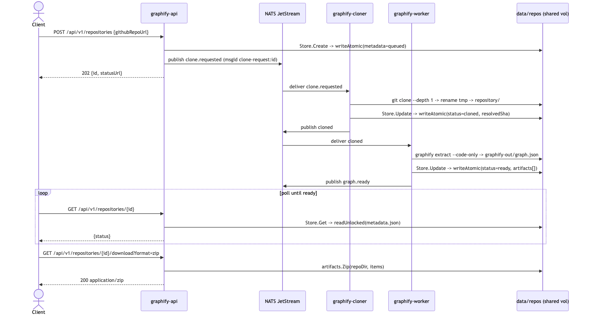
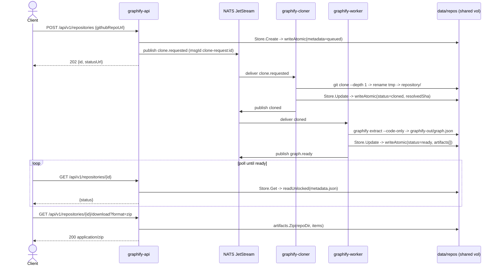
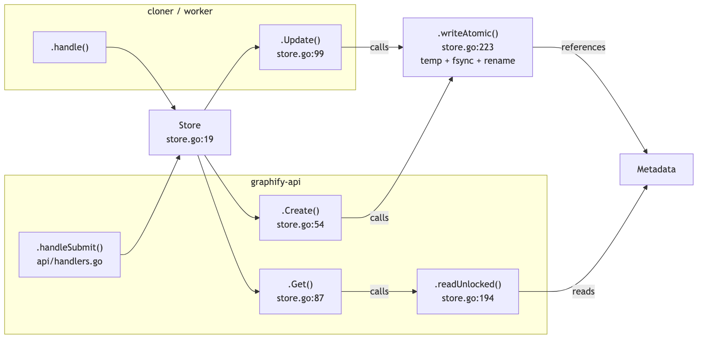
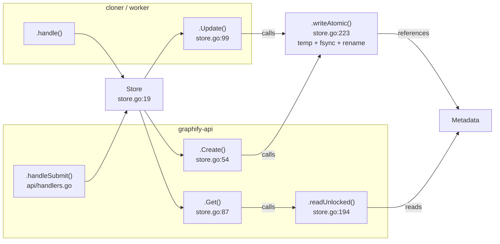

# Backend call flow — filesystem write path

How a request travels **client → api → queue → worker → api → client**, and where
it lands on the filesystem. The static call graph is **generated by graphify from
our own `backend/`** (dogfooding); the runtime sequence is the async flow that the
static graph can't cross (the NATS queue decouples api and workers).

> Diagrams render inline on GitHub (mermaid) and are also committed as PNGs under
> [`img/`](img/) so they're viewable anywhere.

## Runtime sequence (the hops)





## Static call graph (extracted by graphify from `backend/`)

The API path and the worker path **converge** on the same atomic write on the
shared `Store` — that's where "the value in the backend" lands on disk.





### What graphify actually reported (verbatim)

```
$ graphify path ".handleSubmit()" ".writeAtomic()"
Shortest path (3 hops):
  .handleSubmit() <-method- Server --references--> Store --method--> .writeAtomic()

$ graphify path ".handle()" ".writeAtomic()"
Shortest path (3 hops):
  .handle() <-method- worker --references--> Store --method--> .writeAtomic()

$ graphify explain ".writeAtomic()"
Node: .writeAtomic()
  Source:    internal/repository/store.go L223
  Degree:    4
  Connections (4):
    <-- Store       [method]
    --> Metadata    [references]
    <-- .Create()   [calls]     # API path (POST -> queued metadata)
    <-- .Update()   [calls]     # cloner/worker path (status transitions)
```

Note the **gap the static graph can't draw**: there is no edge from api → worker —
that hop is the NATS queue (async, decoupled). The runtime sequence above shows it.

## Prompt to reproduce

Natural-language ask (to Claude Code, this repo):

> "Show me the call flow for the filesystem write — from a client → api → queue →
> worker → api → client — as a runtime sequence diagram, plus the **static call
> graph from our own repo** (run graphify on `backend/`). Trace the path from the
> API submit handler to the atomic metadata write, and render both as mermaid +
> PNG."

Concrete commands (what produced the static graph + paths above):

```bash
# 1. Extract our Go backend into a knowledge graph (local AST, no LLM key)
tmp=$(mktemp -d); cp -r backend/{api,cloner,worker,internal,go.mod,go.sum} "$tmp"/
docker run --rm -v "$tmp":/w -w /w --entrypoint graphify \
  marcellodesales/graphify:latest extract /w --code-only      # -> graphify-out/graph.json

# 2. Ask the graph about the filesystem write path
docker run --rm -v "$tmp":/w -w /w --entrypoint graphify marcellodesales/graphify:latest \
  path ".handleSubmit()" ".writeAtomic()"
docker run --rm -v "$tmp":/w -w /w --entrypoint graphify marcellodesales/graphify:latest \
  explain ".writeAtomic()"
docker run --rm -v "$tmp":/w -w /w --entrypoint graphify marcellodesales/graphify:latest \
  query "how is metadata written to the filesystem"

# 3. (optional) interactive rendering: graph.html + GRAPH_REPORT.md
docker run --rm -v "$tmp":/w -w /w --entrypoint graphify marcellodesales/graphify:latest \
  cluster-only /w   # writes graphify-out/graph.html
```

Or through the running service (submit this repo, then query it):

```bash
curl -s -X POST http://localhost:8080/api/v1/repositories \
  -H 'content-type: application/json' \
  -d '{"githubRepoUrl":"https://github.com/marcellodesales/graphify-service"}'
# poll to ready, then:
curl -s -X POST http://localhost:8080/api/v1/repositories/<id>/query \
  -H 'content-type: application/json' \
  -d '{"question":"how is metadata written to the filesystem"}'
```

## Regenerate the PNGs

```bash
npx -y @mermaid-js/mermaid-cli -i docs/diagrams/backend-call-flow-sequence.mmd \
  -o docs/img/backend-call-flow-sequence.png -b white -s 2
npx -y @mermaid-js/mermaid-cli -i docs/diagrams/backend-call-flow-static.mmd \
  -o docs/img/backend-call-flow-static.png -b white -s 2
```
